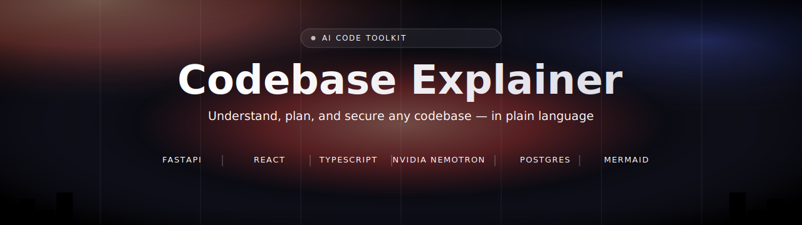
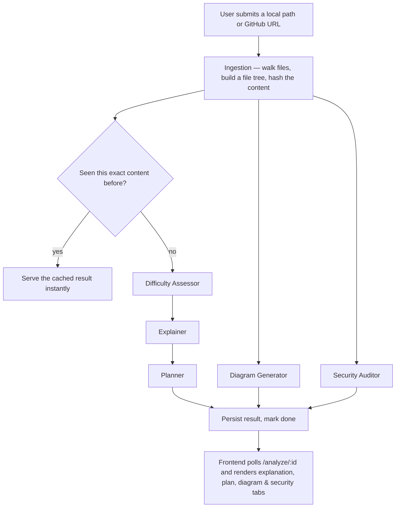
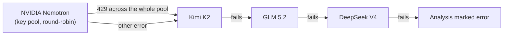

<!--
  Before publishing: replace <github-username> below with your real GitHub
  username/org so the CI and star/fork badges point at the right repo.
-->

<p align="center">
  
</p>

<p align="center">
  <a href="LICENSE"></a>
  
  
  
  
  
  
  <br/>
  <a href="https://github.com/&lt;github-username&gt;/codebase-explainer/actions/workflows/ci.yml"></a>
  
  
  
  <a href="https://github.com/&lt;github-username&gt;/codebase-explainer/stargazers"></a>
</p>

<h3 align="center">Understand, plan, and secure any codebase — in plain language.</h3>

<p align="center">
  Point it at a local directory or a public GitHub repo. Five AI agents read the code and hand back
  a difficulty-tiered explanation, a phased improvement plan, a Mermaid architecture diagram, and a
  security audit — usually in under two minutes.
</p>

<p align="center">
  <a href="#-quick-start"><b>Quick Start</b></a> ·
  <a href="#-how-it-works"><b>How it works</b></a> ·
  <a href="#-tech-stack"><b>Tech stack</b></a> ·
  <a href="#-api-reference"><b>API</b></a> ·
  <a href="#-deployment"><b>Deployment</b></a> ·
  <a href="#-roadmap"><b>Roadmap</b></a>
</p>

---

## ✨ Features

- 🔍 **5-agent AI pipeline** — Difficulty Assessor → Explainer → Planner, plus a Diagram and a
  Security Auditor agent that run **concurrently** with that chain. Critical path is 3 model calls,
  not 5.
- 🔄 **Multi-provider LLM resilience** — pools multiple NVIDIA API keys round-robin (so one key's
  per-minute rate limit never becomes the whole app's ceiling), with an automatic fallback chain
  through **Kimi K2 → GLM 5.2 → DeepSeek V4** if the primary is rate-limited or down. Every tier is
  independently optional.
- ⚡ **Content-hash caching** — identical code returns an instant result, for free, no matter who
  submitted it first.
- 📊 **Real-time progress** — the backend reports per-agent completion; the UI shows a live
  "3 of 5 agents complete" bar instead of a fake spinner.
- 🔐 **JWT auth** with bcrypt-hashed passwords, and a free/Pro tier quota system (10 vs 500
  analyses/month).
- 🛡️ **Defense-in-depth** — a blocklist keeps local-directory analysis out of system paths
  (`/etc`, `/Users`, `/System`, …), LLM-generated markdown is sanitized with DOMPurify before
  rendering, every analysis record is access-controlled per-user, and `slowapi` rate-limits requests.
- 🤖 **Optional abuse guard & error tracking** — Cloudflare Turnstile on registration and Sentry
  error tracking are both wired in but **no-op until you configure them** — nothing to set up for
  local dev.
- 🌐 **GitHub repo analysis** via the public REST API — no auth needed for public repos.
- 🎨 **Polished dark-mode UI** — React 19 + Tailwind 4 + Motion animations, live Mermaid diagram
  rendering, and a markdown report viewer.
- 🧪 **24 passing tests**, offline-mocked (no live API calls), with CI running on every push.

---

## 🧠 How it works



`E → F → G` is a genuine chain (the Explainer needs the difficulty result; the Planner needs the
explanation). `H` and `I` only need the raw ingested files, so they run **in parallel** with that
chain via `asyncio.gather` — dropping the critical path from 5 sequential model calls to 3.

### LLM resilience chain



A rate limit on one key says nothing about model quality, so it's retried across the pool first.
Only once the whole pool is exhausted (or a non-rate-limit error occurs) does it walk the fallback
chain — each tier optional, skipped entirely if its key isn't configured.

---

## 🛠️ Tech stack

<table>
<tr><td valign="top">

**Backend**

- **FastAPI** — async web framework, routing, validation, DI
- **Uvicorn** — ASGI server
- **Pydantic + pydantic-settings** — request/response schemas, typed env config
- **SQLAlchemy 2.0 (async)** — ORM, same code for SQLite (dev) and Postgres (prod)
- **aiosqlite / asyncpg** — async DB drivers
- **python-jose** — JWT signing/verification
- **passlib + bcrypt** — password hashing
- **openai SDK** — talks to NVIDIA's OpenAI-compatible endpoint (Nemotron, Kimi, GLM, DeepSeek)
- **httpx** — GitHub API + Turnstile verification calls
- **slowapi** — per-IP rate limiting
- **sentry-sdk** — error tracking (optional)
- **Celery + Redis** — optional background queue (off by default)
- **pytest + pytest-asyncio** — 24 offline-mocked tests

</td><td valign="top">

**Frontend**

- **React 19 + TypeScript** — UI
- **Vite 8** (Rolldown) — dev server + bundler
- **react-router-dom** — client-side routing, code-split lazy pages
- **Tailwind CSS 4** — styling, `@tailwindcss/typography` for markdown
- **Motion** — animations (hero reveal, card tilt, transitions)
- **Three.js** — WebGL hero/login backgrounds
- **marked + DOMPurify** — markdown → sanitized HTML
- **Mermaid** — renders the AI-generated architecture diagrams
- **@sentry/react** — error tracking (optional)
- **lucide-react** — icons

</td></tr>
</table>

---

## 🚀 Quick start

```bash
git clone https://github.com/<github-username>/codebase-explainer.git
cd codebase-explainer

# Backend
python3 -m venv .venv
.venv/bin/pip install -r requirements.txt
cp .env.example .env             # fill in NVIDIA_API_KEY + JWT_SECRET_KEY
.venv/bin/uvicorn app.main:app --reload

# Frontend (separate terminal, for hot-reload dev)
cd frontend
npm install
npm run dev
```

Open **http://localhost:5173** (Vite dev server, proxies API calls to `:8000`) or
**http://localhost:8000** (FastAPI serving the production build directly — one process, one deploy).

---

## ⚙️ Environment variables

Only `NVIDIA_API_KEY` and `JWT_SECRET_KEY` are required — everything else has a sane default or is
opt-in.

<details>
<summary><b>Show full list</b></summary>

| Name | Required | Purpose |
|------|----------|---------|
| `NVIDIA_API_KEY` | **Yes** | Primary NVIDIA API key — get one at [build.nvidia.com](https://build.nvidia.com) |
| `NVIDIA_API_KEYS` | No | Comma-separated extra keys pooled alongside the primary — multiplies concurrent-analysis headroom for free |
| `NVIDIA_BASE_URL` | No | Default `https://integrate.api.nvidia.com/v1` |
| `NVIDIA_MODEL` | No | Default `nvidia/nemotron-3-ultra-550b-a55b` |
| `FALLBACK_API_KEY` | No | Kimi K2 key — 1st fallback tier |
| `GLM_API_KEY` | No | GLM 5.2 key — 2nd fallback tier |
| `DEEPSEEK_API_KEY` | No | DeepSeek V4 key — 3rd fallback tier |
| `JWT_SECRET_KEY` | **Yes** | Random hex string — `openssl rand -hex 32` |
| `JWT_ALGORITHM` | No | Default `HS256` |
| `ACCESS_TOKEN_EXPIRE_MINUTES` | No | Default `1440` (24h) |
| `DATABASE_URL` | No | Default SQLite; swap for Postgres in production, zero code changes |
| `CORS_ORIGINS` | No | Comma-separated allowed origins |
| `RATE_LIMIT_PER_HOUR` | No | Default `10` |
| `MAX_FILE_SIZE_BYTES` | No | Default `512000` |
| `MAX_TOTAL_CONTENT_BYTES` | No | Default `2097152` |
| `USE_CELERY` | No | Default `false` — FastAPI `BackgroundTasks`, no Redis needed |
| `REDIS_URL` | No | Only used if `USE_CELERY=true` |
| `TURNSTILE_SITE_KEY` / `TURNSTILE_SECRET_KEY` | No | Cloudflare Turnstile abuse guard on registration — no-op until both are set |
| `SENTRY_DSN` | No | Backend error tracking — no-op until set |
| `VITE_SENTRY_DSN` *(frontend)* | No | Frontend error tracking — no-op until set |
| `VITE_TURNSTILE_SITE_KEY` *(frontend)* | No | Must match `TURNSTILE_SITE_KEY` |

</details>

---

## 📡 API reference

Full interactive schema is auto-generated at `/docs` (Swagger UI) once the server is running.

| Method | Path | Auth | Description |
|--------|------|:---:|-------------|
| `POST` | `/auth/register` | – | Create an account |
| `POST` | `/auth/login` | – | Get a JWT bearer token |
| `GET` | `/auth/me` | ✅ | Current user + quota usage |
| `POST` | `/analyze/local` | ✅ | Submit a local directory — returns `202` + analysis id |
| `POST` | `/analyze/github` | ✅ | Submit a public GitHub repo URL — returns `202` + analysis id |
| `GET` | `/analyze/history` | ✅ | Your last 50 analyses |
| `GET` | `/analyze/{id}` | ✅ | Poll an analysis — status, progress, and results once done |
| `GET` | `/health` | – | Liveness check |

---

## 🧪 Testing

```bash
.venv/bin/pytest tests/ -q       # 24 tests, all offline (LLM calls are mocked)

cd frontend
npx tsc -b                       # typecheck
```

CI (`.github/workflows/ci.yml`) runs both on every push and PR.

---

## 📁 Project structure

```
codebase-explainer/
├── app/
│   ├── analysis/        # ingestion, GitHub fetch, agents, routes, background pipeline
│   ├── auth/             # JWT auth, models, routes
│   ├── main.py            # FastAPI app, static frontend mount, Sentry init
│   ├── config.py          # typed settings (.env)
│   └── database.py        # async SQLAlchemy engine + lightweight migrations
├── frontend/
│   └── src/
│       ├── pages/          # Home, Login, Dashboard, Result, Info, Privacy, Terms
│       ├── components/     # Layout, Turnstile widget, hero/background visuals
│       └── lib/             # typed API client, auth state
├── tests/                # pytest suite (auth + analysis)
├── docs/                  # README assets
└── .github/workflows/     # CI
```

---

## 🌐 Deployment

The whole app is one FastAPI process — it serves the built React frontend directly, so there's
nothing separate to host.

1. **Database:** point `DATABASE_URL` at a hosted Postgres (e.g. [Neon](https://neon.tech) or
   [Supabase](https://supabase.com) free tier) — most free compute tiers have an ephemeral
   filesystem, so SQLite alone will lose data on redeploy.
2. **Build & run:**
   ```bash
   pip install -r requirements.txt
   cd frontend && npm install && npm run build && cd ..
   uvicorn app.main:app --host 0.0.0.0 --port $PORT
   ```
3. **Host:** Render, Railway, or Fly.io all work well for this shape (single process, optional
   Postgres add-on). A Dockerfile isn't required unless you add a second process (e.g. a Celery
   worker).

See [`PLAN.md`](PLAN.md) for the full staged rollout (launch hardening → deploy → 0-to-100-users
growth plan).

---

## 🗺️ Roadmap

- [x] 5-agent pipeline with parallel diagram/security agents
- [x] Multi-key pooling + 3-tier LLM fallback chain
- [x] Content-hash caching, JWT auth, tier quotas
- [x] Real-time progress reporting
- [x] Optional Turnstile + Sentry
- [ ] Stripe billing (tier system is wired; checkout/webhook not yet built)
- [ ] Follow-up Q&A chat on a completed analysis (flagship Pro feature)
- [ ] Team/workspace accounts

---

## 🔒 Security

Found a vulnerability? Please don't open a public issue — see [`SECURITY.md`](SECURITY.md) for
reporting instructions *(fill in the contact email there before your first public release)*.

---

## 🤝 Contributing

Issues and PRs welcome. Please run the test suite and typecheck before submitting
(`pytest tests/ -q` and `npx tsc -b` in `frontend/`).

---

## 📄 License

[MIT](LICENSE)

<p align="center">
  <sub>Built with FastAPI, React, and NVIDIA Nemotron.</sub>
</p>
